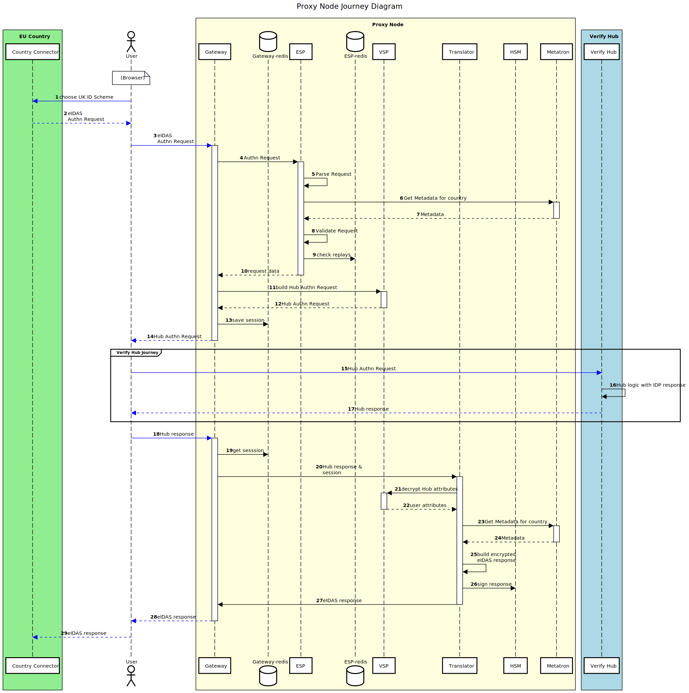

# UK Proxy Node Journey Sequence

The High level interactions a user has with the Proxy Node are:
- A user requests a UK identity via a Member State (MS) Connector Node
- An eIDAS request is sent to the UK Proxy Node
- The UK Proxy Node sends a new request, via the user's browser, to Verify Hub
- Verify Hub responds eventually with the user's identity attributes
- The Proxy Node sends an eIDAS response back to the Member State Connector Node via the user's browser.

These interactions and the flow of data within the Proxy Node are detailed in this sequence diagram:

---
Diagram Notes:
- Dashed arrows indicate a response
- Arrows in blue indicate a browser request or response
- The Verify Hub Journey isn't detailed in this diagram
- You can edit this diagram by loading `images/pn_sequence.txt` into https://sequencediagram.org/
---
