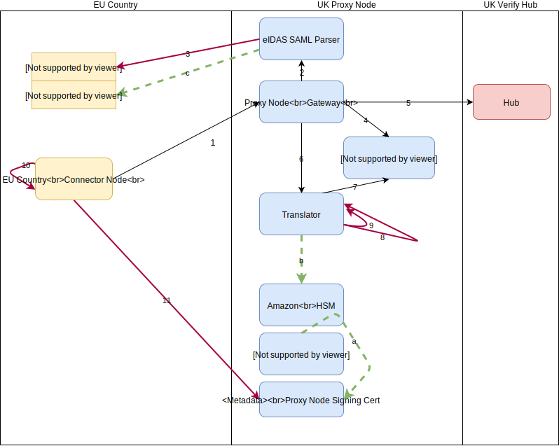

# GOV.UK Verify UK Proxy Node PKI

The eIDAS Proxy Node Public Key Infrastructure (PKI) is detailed in the diagram below.
It addresses SAML encryption/decryption, signing/validation, and publishing of PKI metadata between the UK Proxy Node and an EU connecting country.
The key describes a sequential flow of an eIDAS SAML message

Key to Diagram:

| Step      | Description |
| :----:       |    :---     |
| a      | At startup, the `metadata-controller` connects to `CloudHSM` to produce a signing keypair. It publishes the public key on `metadata`
| b   | At startup, `translator` stores a copy of the private signing key generated in the step above
| c   | `eidas-saml-parser` reads and stores a copy of the EU country's public encryption certificate from EU country metadata
| 1   | The EU Country produces a signed eIDAS SAML Request, and sends to `gateway` via the browser
| 2   | `gateway` sends the signed eIDAS SAML Request to `eidas-saml-parser`
| 3   | `eidas-saml-parser` validates the signature of the SAML request using the public signing certificate obtained from EU country metadata
| 4   | `gateway` calls `verify-service-provider` to produce a signed SAML Request for Hub
| 5   | `gateway` builds SAML Request for Hub, and posts to `Hub` via browser
| 6   | `gateway` receives response from Hub, and sends to `translator` to process
| 7   | `translator` calls `verify-service-provider` to provide user attributes
| 8   | `translator` builds an eiDAS SAML Response, and signs it using the private key (from step b)
| 9   | `translator` encrypts the response for EU country using public encryption cert in step c. The `gateway` then sends the eIDAS SAML response to the country via the browser
| 10   | The EU Country decrypts response using private encryption key
| 11   | EU Country decrypts validates Proxy Node signature using public signing key in Proxy Node metadata

Note that PKI between `verify-service-provider` and `Hub` is [documented here](https://www.docs.verify.service.gov.uk/get-started/#get-started).